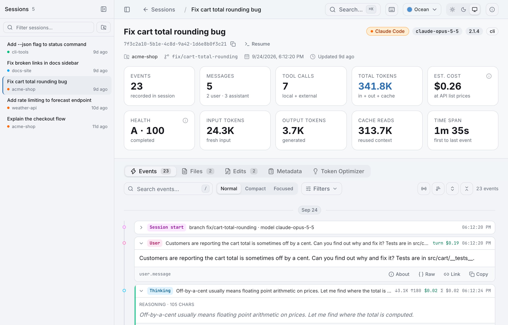
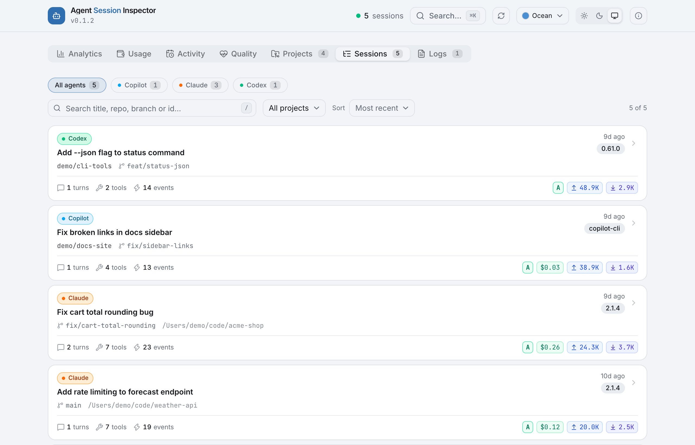
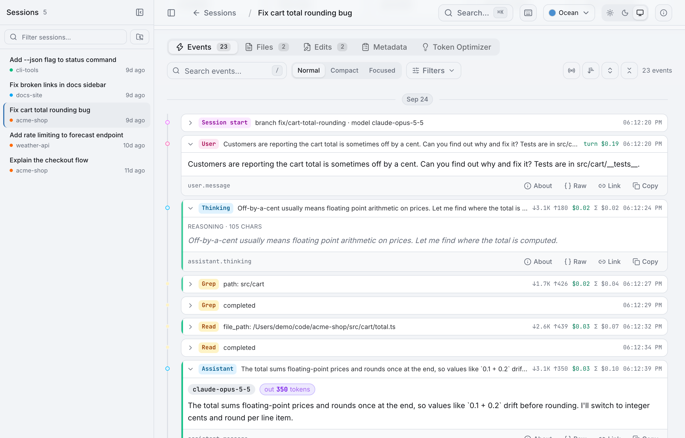
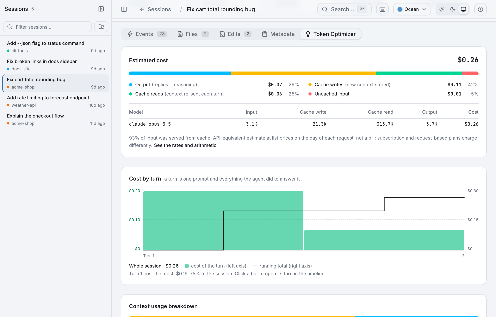

# Agent Session Visualizer

A local web UI for reading agent CLI transcripts: what the agent did, how long it
took, and where the tokens went. It reads the on-disk session files directly and
never sends them anywhere.

<picture>
  <source media="(prefers-color-scheme: dark)" srcset="docs/screenshots/session-overview-dark.png">
  
</picture>

## Screenshots

**All sessions in one place.** Every Copilot, Claude Code and Codex session on
the machine, filterable by agent and searchable by title, repo, branch or id.
Each card shows turns, tool calls and tokens in/out at a glance.

<picture>
  <source media="(prefers-color-scheme: dark)" srcset="docs/screenshots/sessions-dark.png">
  
</picture>

**Step-by-step timeline.** Prompts, reasoning, tool calls and their results in
order, with per-step token counts. Expand any event to see its content, or open
the raw record.

<picture>
  <source media="(prefers-color-scheme: dark)" srcset="docs/screenshots/timeline-dark.png">
  
</picture>

**Token Optimizer.** Where the context went (system prompt vs. tool results vs.
replies), which tools ran most, and hints for trimming expensive sessions.

<picture>
  <source media="(prefers-color-scheme: dark)" srcset="docs/screenshots/token-optimizer-dark.png">
  
</picture>

**Projects.** Sessions are grouped by the repository they ran in, so work
started from a subfolder or a git worktree lands in the same project. The
Projects tab lists each one with its sessions, cost and tokens, and picking a
project filters Analytics, Usage and Sessions together. Outside a repository,
the working directory is the project; the dated scratch folders the Codex app
creates for project-less chats count as one project.

> Screenshots use synthetic demo data. To reproduce them locally, see
> [Demo data](#demo-data).

Supported agents:

| Agent               | Reads from                                       | Session titles       | Logs |
| ------------------- | ------------------------------------------------ | -------------------- | ---- |
| GitHub Copilot CLI  | `~/.copilot/session-state`, `~/.copilot/logs`     | checkpoint DB        | yes  |
| Claude Code         | `~/.claude/projects/<project>/<session>.jsonl`    | `custom`/`ai` titles | no   |
| OpenAI Codex CLI    | `~/.codex/sessions/YYYY/MM/DD/rollout-*.jsonl`    | `session_index.jsonl`| no   |

Whichever directories exist on the machine show up; the rest are hidden.

## Getting started

Install the prebuilt app (needs [Node.js](https://nodejs.org) 22.13 or newer):

```bash
curl -fsSL https://github.com/kishanmundha/agent-session-visualizer/releases/latest/download/install.sh | bash
```

Then start it:

```bash
agent-session-visualizer
```

It serves on [http://localhost:3000](http://localhost:3000) (or the next free
port), bound to `127.0.0.1` only, and opens your browser. `--port`, `--host` and
`--no-open` change that; `--help` lists everything.

The app lives in `~/.agent-session-visualizer` with a command linked into
`~/.local/bin`. Re-run the install command to update. To uninstall:

```bash
rm -rf ~/.agent-session-visualizer ~/.local/bin/agent-session-visualizer
```

### From source

```bash
pnpm install
pnpm dev
```

Open [http://localhost:3000](http://localhost:3000).

To run it in Docker with the transcript directories mounted read-only:

```bash
pnpm deploy:docker
```

### Demo data

To try the UI without your own transcripts (or to retake the screenshots),
generate a fake home directory with a few synthetic sessions and point the app
at it:

```bash
node scripts/demo-data.mjs /tmp/asv-demo
HOME=/tmp/asv-demo pnpm dev
```

### Releasing

Push a version tag and the [release workflow](.github/workflows/release.yml)
builds the app and publishes `agent-session-visualizer.tar.gz` and `install.sh`
as a GitHub release, which is what the install command downloads:

```bash
git tag v0.2.0
git push origin v0.2.0
```

`pnpm package` builds the same archive locally into `dist/`. To test the
installer against it without publishing:

```bash
ASV_TARBALL_URL="file://$PWD/dist/agent-session-visualizer.tar.gz" bash install.sh
```

## How it works

Every agent writes a different transcript format, so the app normalizes them into
one canonical event vocabulary and the UI only ever sees that.

```
src/lib/providers/
  types.ts      canonical model: SessionMeta, AgentEvent, SessionDetail, SessionProvider
  analysis.ts   provider-agnostic stats + token-cost hints
  pricing.ts    dated price table lookup, per-event and per-session cost
  prices.json   bundled list prices, USD per million tokens
  fs-utils.ts   jsonl reading, directory walking, mtime-keyed caching
  copilot.ts    ~/.copilot adapter
  claude.ts     ~/.claude adapter
  codex.ts      ~/.codex adapter
  index.ts      registry: listSessions / getSession / listLogs across providers
```

Events are typed `category.subCategory` — `user.message`, `assistant.message`,
`assistant.thinking`, `tool.execution_start`, `tool.execution_complete`,
`external_tool.requested`, `context.attachment`, `file.patch_applied`,
`web.search`, `session.*`. Anything an adapter emits outside that list still
renders through a generic card, so a new record type is never a crash.

Token accounting is centralized: adapters put per-message usage on the event
(`inputTokens` / `outputTokens` / `cacheReadTokens`) or, when a provider reports
running totals, attach `data.sessionTotals`. The latest `sessionTotals` wins over
summation.

### Cost estimates

Each session, and each request in the timeline, shows an estimated cost in
dollars. Adapters attach `data.billedUsage` to the events that carry usage, with
uncached input, cache reads, cache writes and output kept as separate,
non-overlapping counts, and `pricing.ts` multiplies them by the model's list
price. The Token Optimizer tab splits the total by token class and by model.

The figure is an API-equivalent estimate, not a bill: subscription and
request-based plans charge differently, and requests an agent makes outside the
transcript (title generation, for example) are not counted.

Prices are never stored with a session; cost is computed on every load. To
correct a price, add a model the bundled table does not know, or record a price
change, create `~/.agent-session-visualizer/pricing.json`. It is merged over
[`prices.json`](src/lib/providers/prices.json) per model and picked up without a
restart:

```json
{
  "my-local-model": { "input": 0, "output": 0 },
  "claude-opus-5-5": [
    { "input": 4, "output": 20, "cacheRead": 0.2, "cacheWrite": 5, "cacheWrite1h": 8 },
    { "from": "2027-01-01", "input": 3, "output": 15, "cacheRead": 0.15, "cacheWrite": 3.75, "cacheWrite1h": 6 }
  ]
}
```

A model with several entries is priced by date: each request uses the entry
whose `from` day is the latest one on or before the request, so a price change
does not rewrite the cost of older sessions. Models with no price show as
unpriced and are left out of the total rather than counted as free.

### Session health

Every session gets a score out of 100 and a grade (A to F), shown on its card
and in its header. The score is rule-based and read straight off the transcript
by `health.ts`: it measures how smoothly the session ran, not whether the result
was any good. A session starts at 100 and loses points for:

| Signal            | What it means                                           | Points          |
| ----------------- | ------------------------------------------------------- | --------------- |
| Unfinished        | Ends on an API error, or stops without a final reply    | 25 / 15         |
| Tool failures     | Share of tool results that failed                       | up to 25        |
| Retry loops       | The same tool failing three times in a row              | 6 each, max 18  |
| API errors        | Errors and retried requests                             | 2 each, max 10  |
| Interrupted turns | Turns stopped before the agent finished                 | 4 each, max 12  |
| Compactions       | Context summarized mid-session                          | 3 each, max 9   |

90 and up is an A, 80 a B, 70 a C, 60 a D. A session that is still running is not
marked down for being unfinished. Click the Health card on a session to see what
it lost points for and jump to those events; the Quality tab on the home page
shows grades, outcomes and the most common problems across sessions.

### Adding a provider

1. Write `src/lib/providers/<name>.ts` exporting a `SessionProvider`: `info`,
   `isAvailable`, `listSessions`, `getSession`, plus `listLogs`/`getLogContent`
   (return empty when the agent has no log directory).
2. Map its records onto the canonical event types; cap huge payloads before they
   reach the client, and set `resultChars` on tool results so the token review
   can size them. Attach `billedUsage` wherever the transcript reports usage so
   the session can be priced.
3. Register it in `src/lib/providers/index.ts` and add its id to
   `ProviderId` in `types.ts`.
4. Add its badge colours to `src/lib/provider-meta.ts`.

Routes are provider-scoped: `/sessions/<provider>/<id>` and
`/api/sessions/<provider>/<id>`.
